This tutorial will explain how to get the content of this file: [ball.sia](ball.sia) and convert it to an OBJ file, that every 3d software can read.

Those SIA files are extracted from the game using the Resource Archiver. This particular file was extracted from *simatchviewer.fmf* (located in the program files folder), inside the mesh/ball folder.

You will need this program : 3d Model Researcher, which you can download here : http://mr.game-viewer.org/download.php

## 1. Vertices

The first thing we have to do is find the vertices: a list of all the points used by the 3d model.
In the "hex view" part of the program, try to find a pattern that indicates the position of the vertices.

*Tip: it's usually 00 / 00 / 80 / 3F, or plain 00s.*

In this example, all vertices start after a sequence of 00 / 00 / 80 / 3F.
The first one is at 0x178, and we have to use a padding of 36 so the pattern actually loops over those 00 / 00 / 80 / 3F.
We first try with 10 values (count = 10) to see what it looks like.

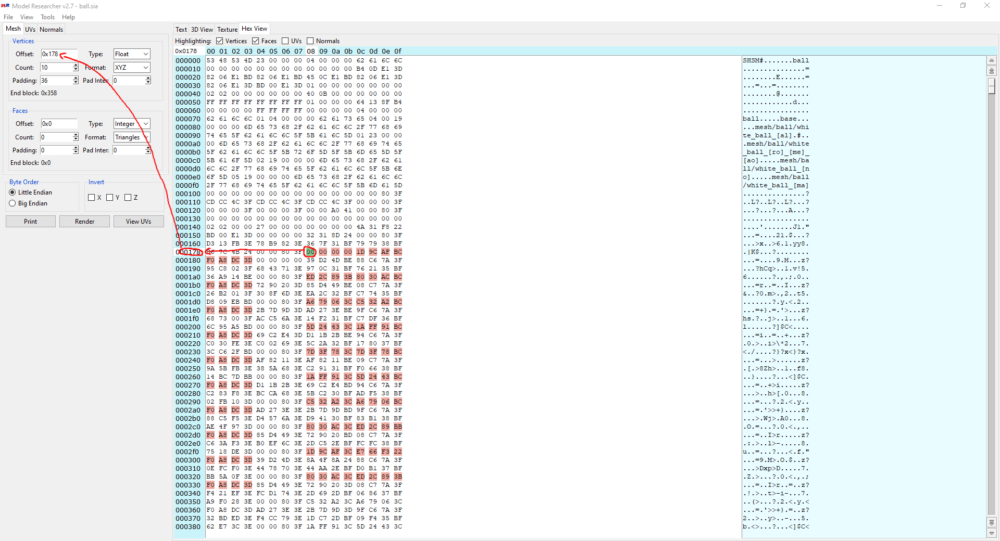

In the "text" tab, make sure "vertices" is checked, then click "print". It will show the coordinates of the 10 vertices.
We are looking for float values usually between -1 and 1. This looks good so far.

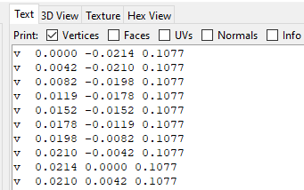

Now that we are pretty sure we have the correct offset and padding, it's time to find the correct value for "count".
The easier way is just trial and error. Try a value then click "print". If it's too big, you'll have this error :

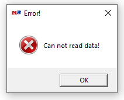

When we start to see absurd values (and/or lots of 0.000), this means we went too far, and we have to lower our count.
Here, we found 37 absurd values with a count of 550, which means the final value for "count" should be 513.

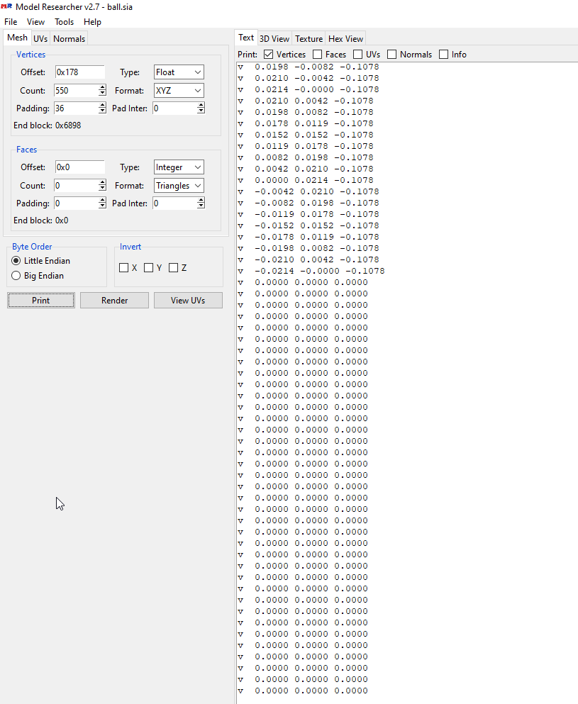

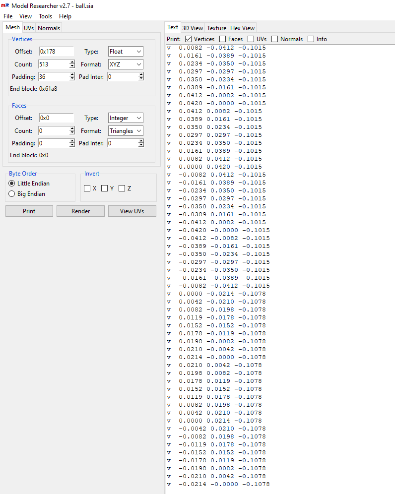

To make sure we're on the right track, go to the "3d view" tab. Make sure "vertices" is checked and click "render".
You should see all the points of our ball 3d model.

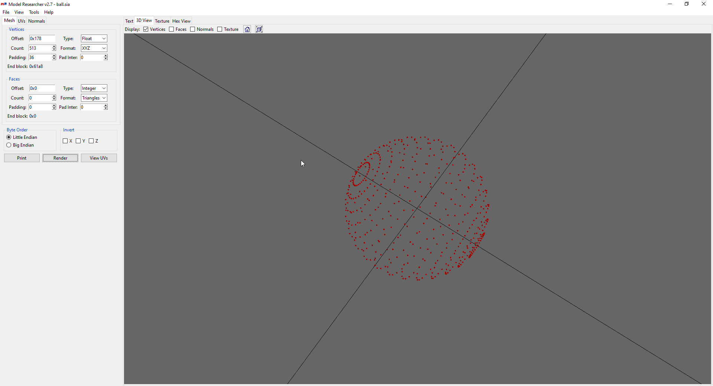

## 2. Faces

Our next goal is to find faces. Those are triangles and refer to the list of vertices we just discovered.
For example, a face looking like that : "0 4 8" means that the first, 5th and 9th vertices should form a triangle (the first index is 0).

First, change the "type" to "short", as it's usually how faces are stored in FM files. A short number is 2 bytes long, so a triangle consisting of 3 numbers would be 6 bytes.
As with the vertices, we now have to find a good spot to start. The list of faces usually start with the very first vertex indexes (for example, the first face could be something like "0 1 2").
0x61aa looks like a promising sport to start, because we see from there a lot of small numbers. Let's try it :

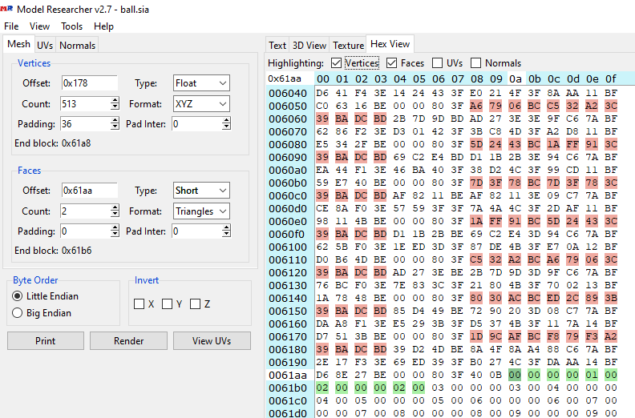

Go back to the "text" tab, make sure "faces" is checked this time.

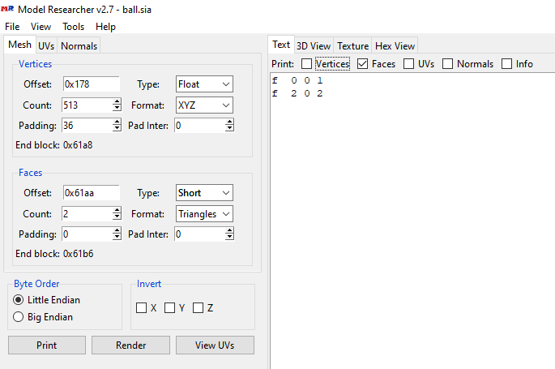

This actually doesn't look very good : we can't have the same number twice in each triangle!
Let's try again, this time starting at 0x61ac.

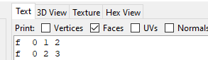

This is better.
To make sure we're on the right track, change the count to a significantly higher value (still not looking for the exact value right now though), and try to render the model :

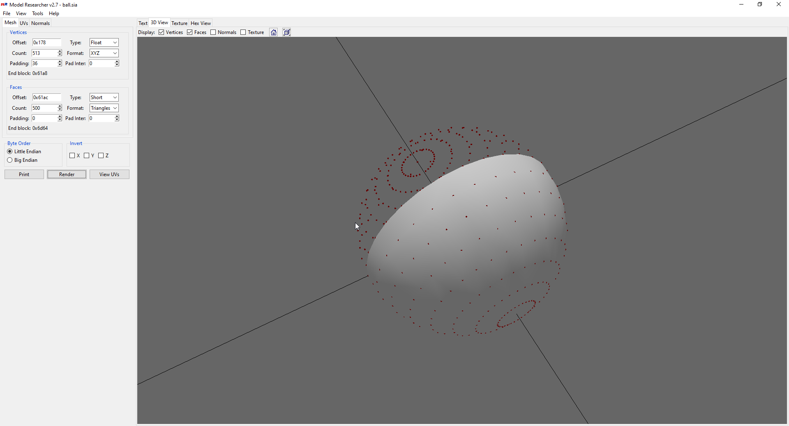

It looks like we're good !

The final thing we have to find is the count. As with the vertices, we'll just have to try until we find absurd values.
This time though, we know that faces usually go almost until the end of the file, so that's where we'll start.
Go to the "hex view" tab and edit the count value until the bytes representing faces (colored in green) reach the end of the file.

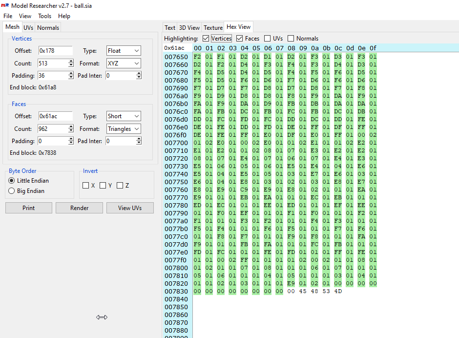

With this count of 962, we find 2 absurd values when printing ("text" tab), so the final count should be 960.

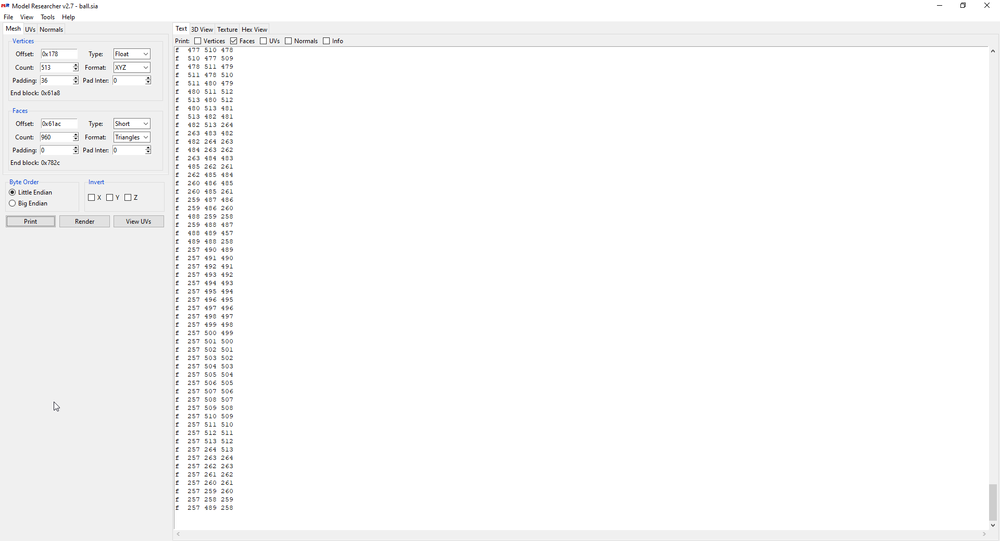

Go back to the "3d view" tab and click render to see the results.

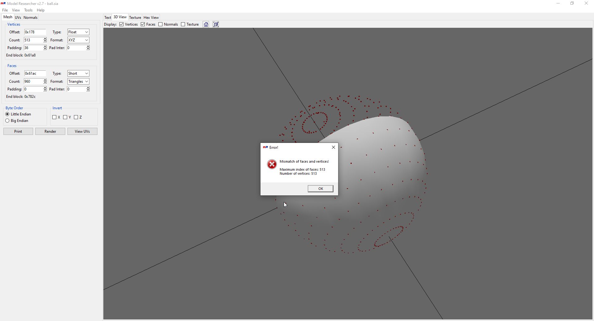

Oops! It looks like we did something wrong. This is a very common error.
We have exactly 513 vertices, but some faces refer to the 514th vertex (remember: index = 513 means 514th vertex).
This kind of off-by-one error usually means that we are simply missing a vertex in our list, and the total vertices count should be 514.

We can't simply edit the vertices count to 514, as the 514th will overlap with our faces.
We have to go back at the very beginning of the file to notice that we may have positioned our vertices offset 1 iteration too far.

We just have to edit the vertices offset from 0x178 to 0x148 and the count from 513 to 514.

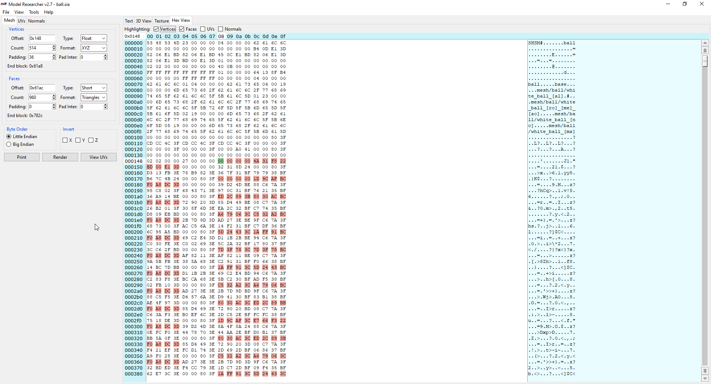

*Tip: you'll usually notice this kind of error with the 3d render once you've got vertices and faces. Since each vertex indexes will be off by one, and faces refer to theses indexes, your faces will look completely wrong. The fact that it didn't with this particular model is probably due to its geometrical shape and/or pure luck.*

We can finally go the the "3d view" tab and render our ball.

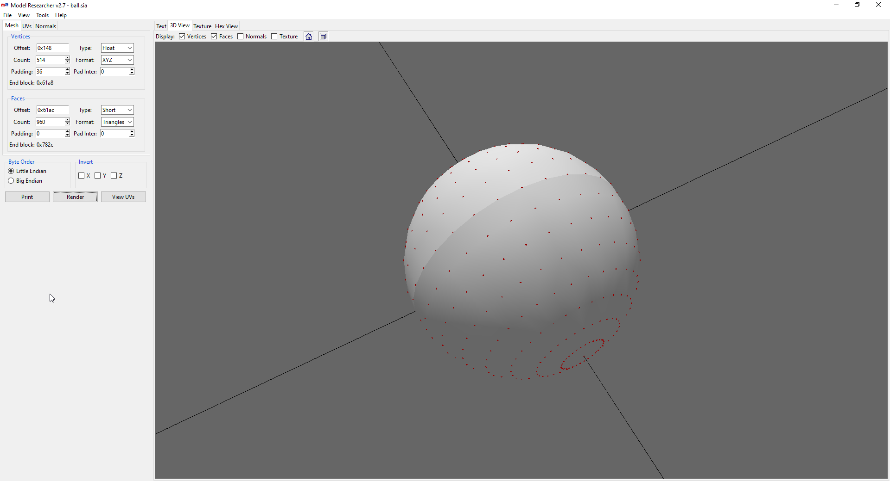

## 3. UV mapping

The last thing we have to find are UVs. Click the "UVs" tab.

Those are usually stored between each vertices ("inside the padding"). This means the count is exactly the same : 514.
UVs are float, so 4 bytes, and they consist of 2 numbers, for a total of 8 bytes. Each vertex being 12 bytes, the padding will have to be the same as the vertices one, plus 4. In our case, 40.
We'll start with an offset of 0x154. Our strategy here is simple : we know UVs are between vertices, so we start right after the end of the first one, and try every offset one by one from here.

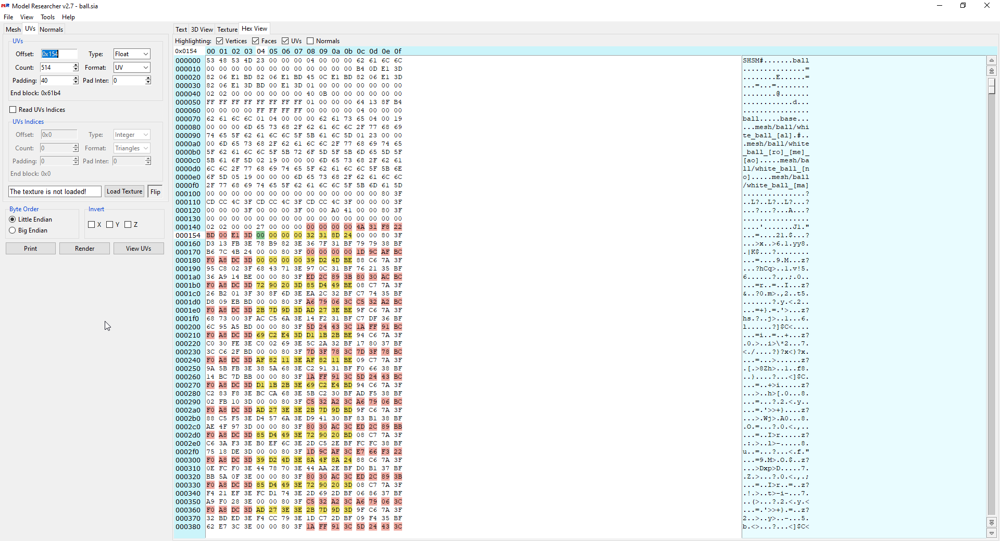

Click "load texture" and choose a texture that you know matches the model. For this example, use [bundesliga.png](bundesliga.png).
Then go to the "texture" tab, make sure "polygons" and "draw texture" are checked, and click "View UVs".

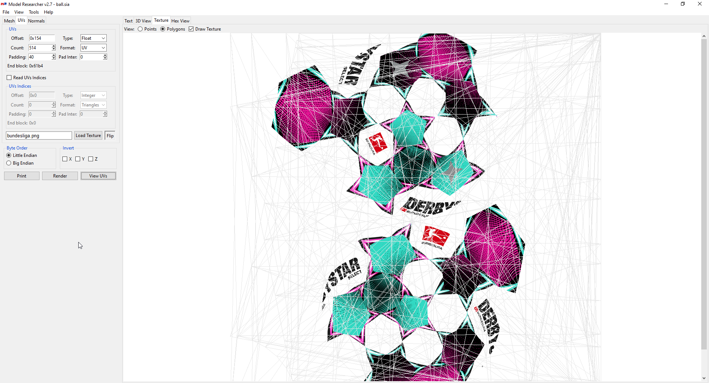

This doesn't look good. Try to increase the offset by one (so, 0x155) and click again on "View UVs".

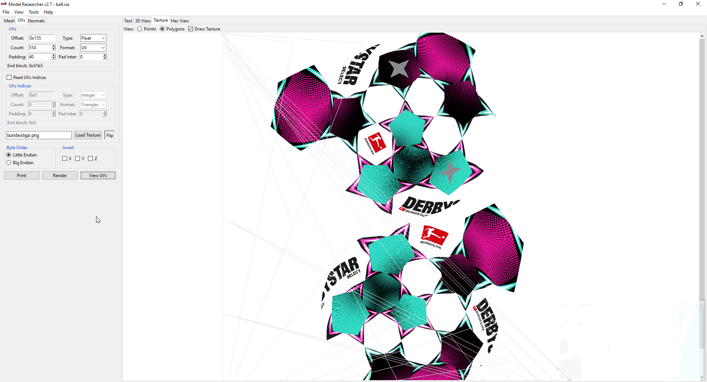

Still not good. We'll try again, until we find the correct value.

*Tip: When iterating, don't forget we are dealing with hexadecimal numbers. So the next number after 0x159 is 0x15a, then 0x15b etc until 0x15f, then finally 0x160.*

Finally, we find the correct offset : 0x160.

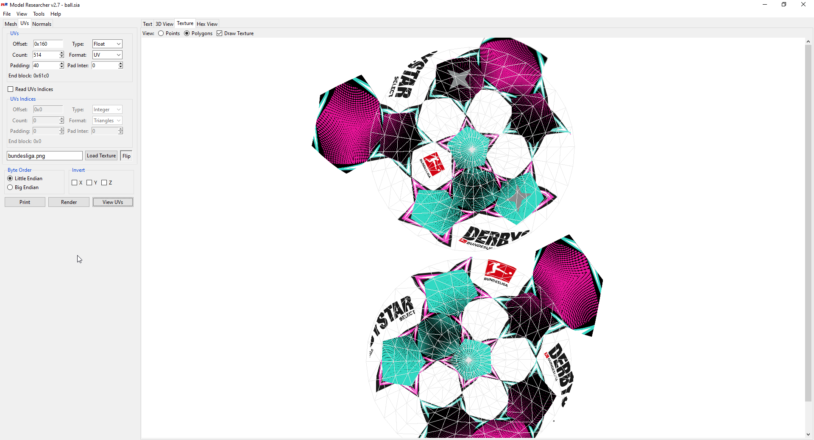

We can go the the 3d view, make sure "texture" is checked this time, and see the results :

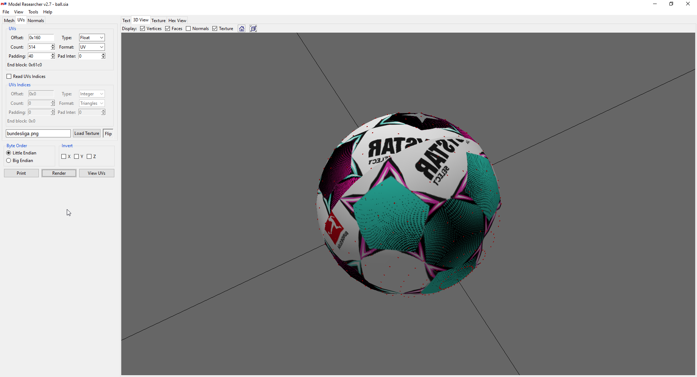

Something is off with the texture. We should flip it (click the "flip" button), and, tada :

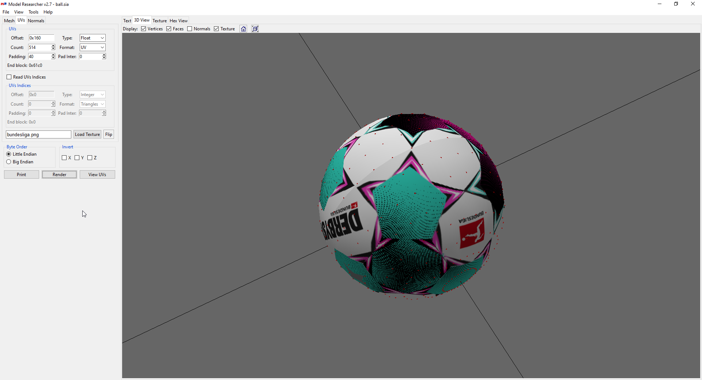

Now that we are done, we can simply save our file as an OBJ file. It will come with an MTL file containing our UV mapping.

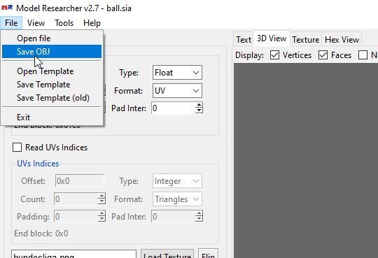

*Tip: OBJ and MTL files are very simple files that you can open with any text editor to see what they look like. It could be useful to edit the texture referred by the MTL file.*

And we are done ! :)